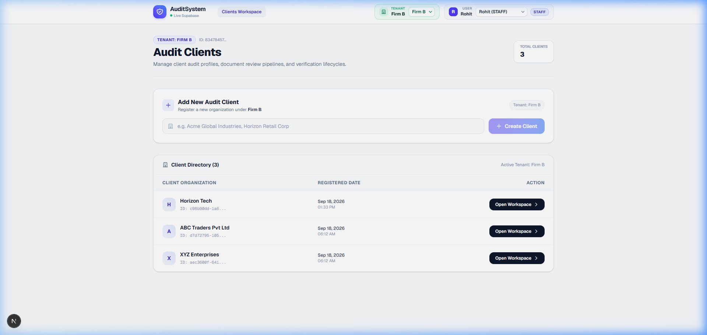
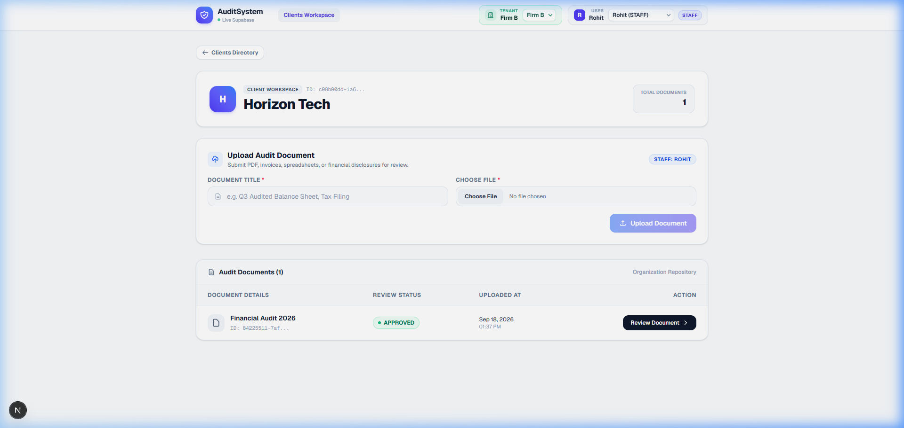
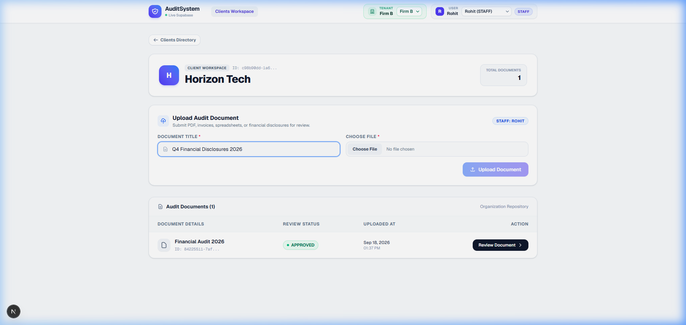
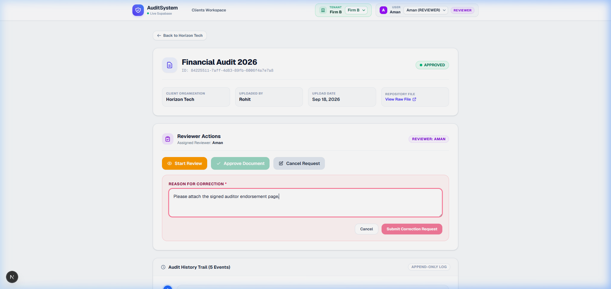
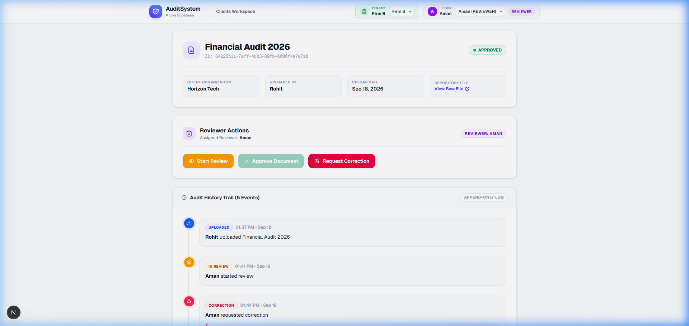

# Mini Audit Document Review System

A prototype audit management platform built for Chartered Accountant (CA) firms to streamline client engagements, document verification workflows, role-based reviews, and tamper-proof audit trails.

---

## Features

- **Client Management**: Create, view, and organize client profiles scoped per CA firm.
- **Document Lifecycle Management**: Full workflow support (`Upload` $\rightarrow$ `Under Review` $\rightarrow$ `Correction Required` $\rightarrow$ `Approved`).
- **Append-Only Audit Logs**: Complete chronological audit trail capturing all user actions, timestamps, and correction reasons.
- **Role-Based Access Control (RBAC)**: Enforced permission boundaries between **Staff** (upload & re-upload) and **Reviewers** (review, approve, request correction).
- **Multi-Tenant Isolation**: Strict data scoping using `firm_id` to separate tenant data across firms.
- **Role & Firm Switcher**: Interactive navbar switchers to simulate different users and firms seamlessly.

---

## Workflow

```text
Staff Uploads Document 
        ↓
Reviewer Starts Review 
        ↓
Reviewer Decision:
  ├──> [Approve] ───────────────> Document Approved (Complete)
  └──> [Request Correction] ────> Document Marked CORRECTION_REQUIRED (with reason)
                                          ↓
                                  Staff Re-uploads Corrected File
                                          ↓
                                  Reviewer Reviews & Approves
```

---

## Screenshots

### 1. Clients Page


### 2. Documents Page


### 3. Upload Document


### 4. Review Document


### 5. Audit History Trail


---

## Tech Stack

- **Framework**: Next.js 16 (App Router, Server & Client Components)
- **Database & Storage**: Supabase (PostgreSQL + Storage Buckets)
- **Styling**: Tailwind CSS
- **Language**: TypeScript

---

## Architecture

```text
Frontend (Next.js UI) ──► App Router / Server Actions ──► Supabase (PostgreSQL & Storage) ──► Append-Only Audit Logs
```

The system uses a tenant-scoped architecture where every query and storage bucket path is filtered by `firm_id`. This guarantees strict multi-tenant isolation, preventing data leakage between different accounting firms while sharing the same underlying database schema.

---

## Key Design Decisions

- **Append-Only Audit Integrity**: Audit logs cannot be edited or deleted under any circumstance to maintain strict compliance and non-repudiation.
- **Role & Firm Simulation**: Global context with simulated users (Staff / Reviewer) and firms for rapid testing without authentication overhead.
- **Tenant-Scoped Access**: Database queries and file storage paths are partitioned by `firm_id` for multi-tenancy.

---

## What Would I Improve With More Time

1. **Authentication & Session Management**: Integrate Supabase Auth / OAuth with JWT-based role validation and MFA.
2. **Real-Time Notifications**: Add email/webhook alerts when documents are assigned, reviewed, or require correction.
3. **Document Versioning & Diffing**: Implement version history trees with side-by-side visual PDF comparisons.
4. **In-Browser Annotation**: Allow reviewers to highlight and comment directly on specific pages of uploaded documents.

---

## AI Usage

### AI Tools Used
- ChatGPT

### How AI Was Used
- **Architecture Planning**: Designing the state transition flow and multi-tenant data schema.
- **Code Generation Assistance**: Implementing App Router server components and Tailwind CSS layout.
- **Debugging & Validation**: Resolving DNS/network configurations, foreign key constraints, and storage RLS policies.

---

## Setup Instructions

1. **Clone the Repository**:
   ```bash
   git clone https://github.com/Shlesha5847/audit-system.git
   cd audit-system
   ```

2. **Install Dependencies**:
   ```bash
   npm install
   ```

3. **Configure Environment Variables**:
   Create a `.env.local` file in the root directory:
   ```env
   NEXT_PUBLIC_SUPABASE_URL=your_supabase_project_url
   NEXT_PUBLIC_SUPABASE_ANON_KEY=your_supabase_anon_key
   ```

4. **Run the Development Server**:
   ```bash
   npm run dev
   ```

5. Open [http://localhost:3000](http://localhost:3000) in your browser.
